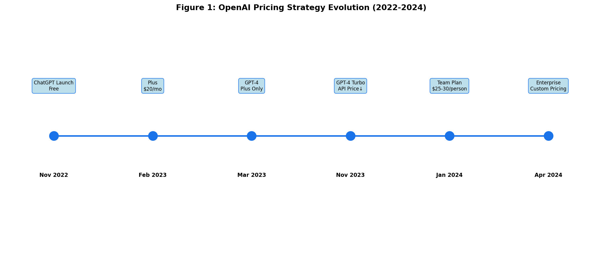
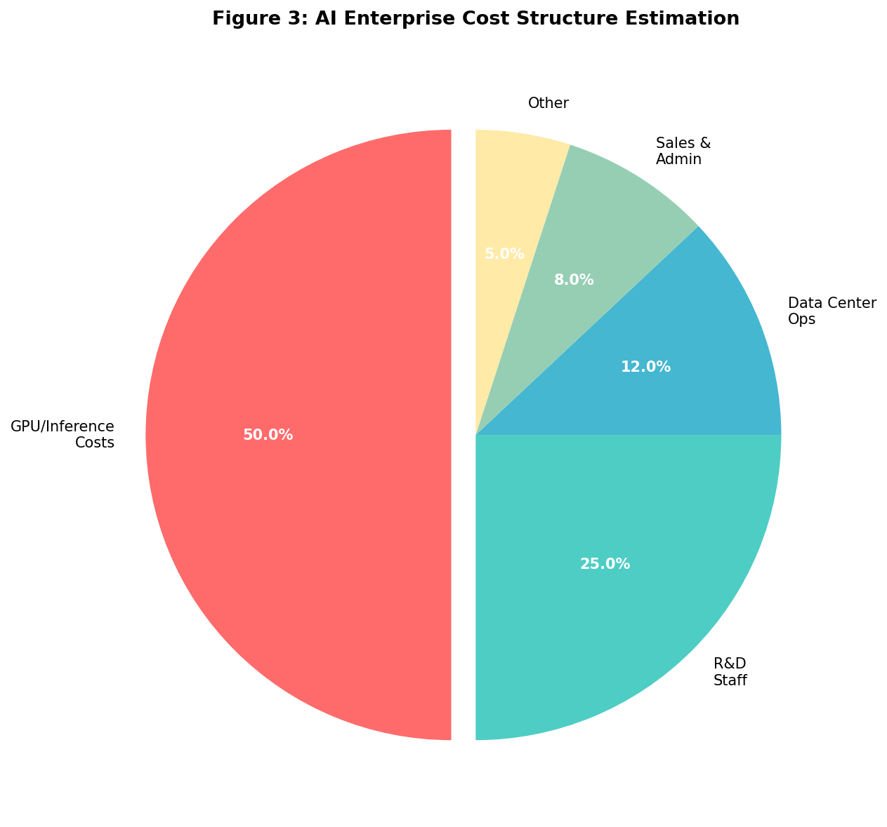
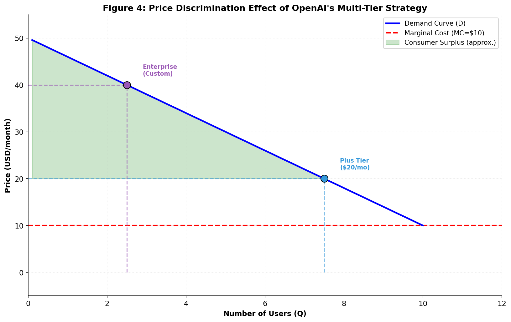
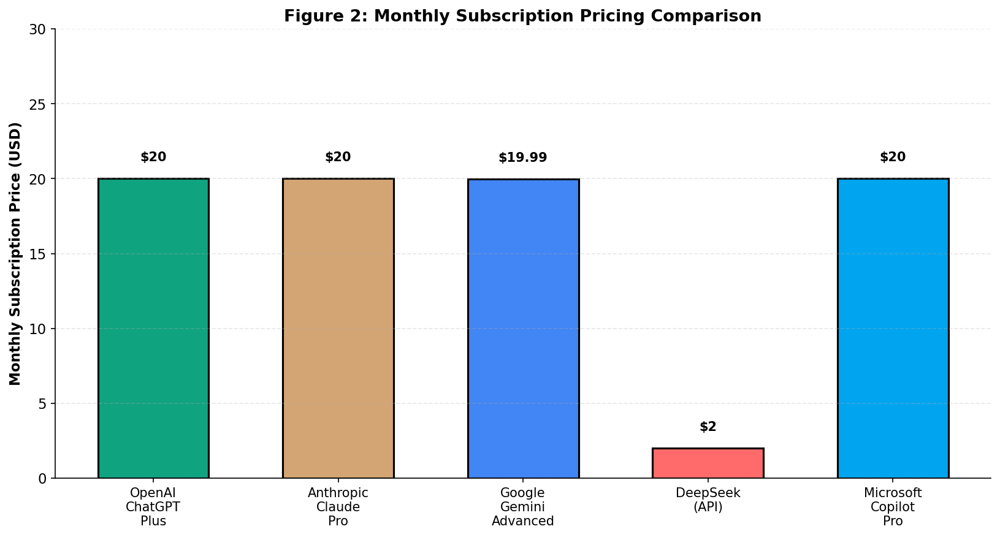

# 人工智能产品的"免费增值"定价策略研究——以OpenAI为例

**学生姓名：陈欢欣　　学号：2120223396**

**学院：营销与物流管理学院　　专业：市场营销**

**指导教师：徐冬莉**

---

## 摘要

随着ChatGPT的发布，生成式人工智能技术迅速席卷全球。然而，大语言模型的每一次交互都伴随着昂贵的推理成本，这使得传统的"免费增值"（Freemium）商业模式面临挑战。本文以OpenAI为核心案例，运用案例分析法、文献研究法和比较分析法，系统剖析其多层级定价体系，探讨在高推理成本约束下免费策略的经济学逻辑。研究发现：OpenAI通过功能限制实现用户筛选，通过免费用户的数据贡献获取非货币化收益，以20美元的Plus订阅价格确立行业锚点。最后，结合DeepSeek等中国企业的竞争策略，为中国AI企业提供策略建议。

**关键词：** 免费增值；人工智能；定价策略；OpenAI；价格歧视

---

## Abstract

With the release of ChatGPT, generative AI technology has rapidly swept the globe. However, each interaction with large language models incurs expensive inference costs, challenging the traditional freemium business model. This paper takes OpenAI as a case study, employing case analysis, literature research, and comparative methods to systematically analyze its multi-tiered pricing system and explore the economic logic of free strategies under high inference cost constraints. The research finds that OpenAI achieves user screening through feature limitations, obtains non-monetary returns through free users' data contributions (RLHF), and establishes industry anchor points with the $20 Plus subscription. Finally, combined with competitive strategies of Chinese companies such as DeepSeek, this paper provides strategic recommendations for Chinese AI enterprises.

**Keywords:** Freemium; Artificial Intelligence; Pricing Strategy; OpenAI; Price Discrimination

---

## 一、引言

自2022年11月OpenAI发布ChatGPT以来，生成式人工智能技术迅速席卷全球，被视为第四次工业革命的核心驱动力。根据瑞银集团（UBS）研究报告，ChatGPT在发布后仅两个月便突破1亿月活跃用户，创造了互联网产品增长的新纪录【待补充：UBS报告具体引用】。这一现象级应用不仅引发了全球范围内的AI创业热潮，也推动了微软、谷歌、百度、阿里等科技巨头纷纷加速布局大语言模型赛道。

然而，伴随着技术热潮而来的，是行业对于商业化变现路径的深刻思考。与移动互联网时代边际成本趋近于零的软件分发模式不同，大语言模型的每一次交互都伴随着昂贵的推理（Inference）成本。根据半导体分析机构SemiAnalysis的测算，以GPT-4为例，单次对话的推理成本约为0.01至0.07美元，重度用户每月可能产生数十美元的算力消耗【待补充：SemiAnalysis报告具体引用】。这种"高固定成本+高边际成本"的特殊成本结构，使得传统的互联网商业模式面临前所未有的挑战。

OpenAI作为行业的领头羊，其采取的"免费增值"（Freemium）定价策略成为了全行业关注的焦点。免费增值模式是指企业提供免费的基础版本以获取海量用户，同时通过付费高级版本实现变现的商业模式（Anderson, 2009）。OpenAI目前形成了包括ChatGPT Free、Plus、Team和Enterprise在内的多层级产品矩阵。这一策略不仅关乎OpenAI自身的生存与盈利，更对全球AI创业公司具有极强的示范效应。特别是在中国市场，随着大模型竞争的持续升级，DeepSeek等本土模型厂商正在通过开源和低价策略重塑市场格局，引发了新一轮的价格竞争。

在此背景下，深入研究OpenAI的定价策略具有重要的理论意义与实践价值。从理论层面看，生成式AI的高推理成本特性对传统免费增值理论的零边际成本假设构成了根本挑战，本研究通过剖析OpenAI的定价策略，可以丰富和拓展现有的互联网定价理论体系。从实践层面看，OpenAI作为行业领头羊，其定价策略对全球AI企业具有强烈的示范效应，深入研究其策略逻辑可为中国AI企业在处理"高昂边际成本"与"市场规模扩张"这一核心矛盾时提供决策参考。

本研究综合运用案例分析法、文献研究法和比较分析法三种研究方法。案例分析法以OpenAI为核心案例，系统梳理其从2022年至今的产品迭代与价格调整路径。文献研究法系统查阅国内外关于价格歧视、双边市场、SaaS定价以及AI经济学的核心文献。比较分析法将OpenAI置于全球AI竞争格局中进行横向对比，特别是与中国的DeepSeek以及Google Gemini、Anthropic Claude等竞品进行策略对比分析。

本文的结构安排如下：第二部分对国内外相关研究进行综述；第三部分分析OpenAI"免费增值"定价策略的现状；第四部分探讨定价策略的经济学机制与成本收益；第五部分讨论行业竞争视角下的挑战与启示；第六部分总结研究结论并提出建议。

---

## 二、国内外研究综述

### （一）国内相关研究综述

国内学术界对"免费增值"模式的研究主要从互联网平台经济领域起步，早期侧重于网络效应下的用户转化机制，认为免费服务是建立用户信任和转移成本的关键。随着人工智能与数字经济的深度融合，研究焦点逐渐转向数据要素价值和AI商业模式的特殊性。

关于免费增值模式的转化机制，学者们进行了广泛探讨。王明等（2023）在不完全信息市场中的动态定价博弈分析中指出，企业在面对异质性消费者时，需要设计精细的筛选机制以实现利润最大化。陈志强和黄伟（2022）对电子商务平台算法定价的竞争效应进行了研究，发现算法驱动的个性化定价可以提高市场效率，但也可能引发消费者公平性担忧。李伟等（2024）对电商平台多产品组合定价进行了优化研究，其研究方法对于分析AI产品的多层级定价具有借鉴意义。

针对生成式AI的高成本特性，国内研究开始反思传统SaaS模式的适用性。陈明等（2023）研究了混合产品组合的协同定价模型，为理解AI产品中API与订阅服务的定价协同提供了理论框架。在人工智能营销领域，朱国玮等（2021）系统梳理了AI营销的研究框架，指出人工智能营销是以大数据和人工智能为基础，智能分析和预测营销活动中隐藏的模式和发展趋势，最终实现企业与用户之间价值共创的营销模式，这一观点为理解AI产品中用户数据价值提供了理论视角。

在竞争策略方面，近期文献开始关注中国本土AI企业的崛起。DeepSeek等企业的开源策略被视为对美国闭源模型的有力挑战。研究指出，中国企业在应用层部署和成本控制上具有优势，通过"开源模型+低价API"的模式，正在构建不同于OpenAI的商业生态。张丽华和杨帆（2023）从前景理论角度分析了组合定价对消费者决策的影响，其研究揭示了锚定效应（Anchoring Effect）在定价策略中的重要作用。

### （二）国外相关研究综述

国外对于SaaS定价策略的研究较为成熟，且近期对生成式AI的经济学分析反应迅速，形成了较为系统的理论流派。

在SaaS与免费增值经济学领域，Anderson（2009）在《免费：商业的未来》一书中系统阐述了免费增值模式的经济学基础，其核心观点是数字产品的边际成本趋近于零，因此企业可以通过海量免费用户分摊固定成本，并依靠极低比例的付费转化率实现盈利。Kumar（2014）进一步研究了免费增值模式中的用户转化机制，发现产品体验质量和功能差异化是驱动用户付费的关键因素。Gu等（2018）基于大规模用户数据，实证分析了免费用户向付费用户转化的影响因素，为理解AI产品的用户转化提供了方法论参考。

针对AI时代的定价模式变革，Agrawal等（2018）在《预测机器》一书中从经济学角度系统分析了人工智能对商业的影响，指出AI本质上是一种预测技术，其价值在于降低预测成本，这一观点为理解AI产品定价提供了重要的理论基础。Varian（2019）作为Google首席经济学家，探讨了AI技术对传统经济学理论的挑战，指出AI产品的规模经济与范围经济特性需要新的定价理论框架。

关于价格歧视理论在数字产品中的应用，Shapiro和Varian（1999）的经典著作《信息规则》提出了版本划分（Versioning）策略，即通过设计不同版本的产品来实现对不同支付意愿消费者的价格歧视，这一理论成为理解OpenAI多层级定价的重要框架。Bhargava和Choudhary（2008）进一步研究了数字产品版本划分的最优策略，发现功能差异化是实现有效价格歧视的关键机制。

在AI推理成本研究方面，Patterson等（2022）在《Carbon Emissions and Large Neural Network Training》中详细测算了大模型训练与推理的能源消耗和成本结构，为理解AI产品的边际成本提供了技术基础。Kaplan等（2020）提出的神经网络规模定律（Scaling Laws）揭示了模型参数、数据量与计算量之间的关系，为分析推理成本随模型规模的变化提供了理论依据。

综合来看，国内外现有研究多集中在低边际成本的传统互联网产品上，关于生成式AI这种"高技术门槛、高边际成本"产品的定价策略研究尚处于起步阶段。现有研究的不足主要体现在三个方面：一是缺乏针对"高推理成本"约束下的定量模型；二是忽视了开源模型对定价体系的解构作用；三是B2B与B2C定价策略的割裂，现有研究往往将消费者端订阅与企业端API服务分开讨论，缺乏从生态系统整体视角审视两者之间的协同效应。本研究将尝试填补上述空白。

---

## 三、OpenAI"免费增值"定价策略现状分析

### （一）OpenAI产品矩阵与定价体系演变

OpenAI的定价策略经历了从完全免费到多层级商业化的演变过程，这一演变过程反映了公司在市场教育、用户获取和商业变现之间的战略权衡。表1展示了OpenAI定价策略的演变历程。

**表1 OpenAI定价策略演变时间线**

| 时间 | 事件 | 定价策略 | 战略意图 |
|------|------|----------|----------|
| 2022.11 | ChatGPT发布 | 完全免费 | 市场教育、用户冷启动、数据积累 |
| 2023.02 | ChatGPT Plus推出 | $20/月 | 商业化探索、确立行业锚点 |
| 2023.03 | GPT-4发布 | Plus专属优先访问 | 功能差异化、提升付费转化 |
| 2023.11 | GPT-4 Turbo发布 | API大幅降价 | 扩大开发者生态、应对竞争 |
| 2024.01 | Team版推出 | $25-30/人/月 | 中小企业市场渗透 |
| 2024.04 | Enterprise版扩展 | 定制化定价 | 大客户战略、数据隐私承诺 |

资料来源：OpenAI官网公告整理【待补充：具体公告链接】

图1直观展示了OpenAI定价策略的演变历程。

**图1 OpenAI定价策略演变时间线（2022-2024）**

2022年11月30日，OpenAI发布ChatGPT，采取完全免费的策略。这一阶段的核心目标是市场教育和用户冷启动。通过免费开放，ChatGPT在两个月内获得了超过1亿用户，免费策略帮助OpenAI快速建立了用户心智，确立了行业领导地位，同时也积累了大量用户交互数据用于模型优化。

2023年2月，OpenAI推出ChatGPT Plus订阅服务，定价20美元每月，标志着公司正式开启商业化探索。Plus版本提供GPT-4优先访问权限、更快的响应速度、高峰期优先使用权以及早期功能体验等权益。20美元的定价具有重要的战略意义：从成本角度看，这一价格大致能够覆盖重度用户的推理成本；从市场角度看，这一价格设置了行业锚点，影响了后续竞争对手的定价决策。

2024年，OpenAI进一步丰富产品矩阵，推出Team版和Enterprise版，进入规模化变现阶段。表2展示了当前OpenAI完整的产品分层与定价策略。

**表2 OpenAI产品分层与定价策略（2024年）**

| 产品层级 | 月费（美元） | 核心功能 | 目标用户 | 数据政策 |
|----------|--------------|----------|----------|----------|
| Free | 0 | GPT-3.5/4o-mini，限制访问次数 | 个人体验用户、学生 | 用于模型训练 |
| Plus | 20 | GPT-4o优先访问，DALL·E 3，高级分析 | 重度个人用户、自由职业者 | 用于模型训练 |
| Team | 25-30/人 | 更高消息上限，协作工作区 | 中小企业团队 | 不用于训练 |
| Enterprise | 定制 | 无限GPT-4o，企业级安全，专属客服 | 大型企业 | 不用于训练 |

资料来源：OpenAI官网（https://openai.com/pricing）【待补充：访问日期】

### （二）免费层价值逻辑的重构

在传统免费增值模式中，免费用户的主要价值在于流量和潜在转化。然而在AI领域，免费用户的角色发生了根本性转变：他们不仅是服务的消费者，更是数据的生产者。

通过RLHF（Reinforcement Learning from Human Feedback，基于人类反馈的强化学习）机制，用户与AI的每一次交互都会产生有价值的数据。RLHF是一种训练大语言模型的方法，通过收集人类对模型输出的偏好反馈来优化模型行为（Ouyang et al., 2022）。用户对AI回答的评价、对话的上下文、提问的方式等，都可以用于优化模型。这种"数据众包"使得免费用户即使不付费，也在为产品改进做出贡献。从这个角度看，免费用户的价值不仅在于潜在的付费转化，更在于其持续的数据贡献。

此外，传统互联网公司需要投入大量营销费用获取用户，而OpenAI通过免费策略实现了用户的自然增长和病毒式传播，大幅降低了用户获取成本（Customer Acquisition Cost, CAC）。ChatGPT发布初期几乎没有营销投入，却实现了史无前例的用户增长，这说明产品力本身就是最好的营销。免费策略还帮助OpenAI抢占了用户心智中的"AI助手"这一品类认知，当用户想到AI对话时，首先想到的是ChatGPT，这种品牌联想构成了强大的竞争壁垒，增加了竞争对手的渗透难度。

### （三）付费层的差异化设计

OpenAI通过精心设计的功能差异实现用户筛选，这种策略在经济学中被称为筛选机制（Screening Mechanism），即通过设计不同版本的产品让消费者自我选择，从而揭示其支付意愿（Shapiro & Varian, 1999）。OpenAI的筛选机制主要体现在四个维度：模型智力、响应速度、使用额度和多模态能力。

在模型智力方面，免费版使用GPT-3.5或受限的GPT-4o-mini，付费版则使用完整的GPT-4o；在响应速度方面，付费用户享有优先访问权，高峰期无需排队；在使用额度方面，免费版有严格的消息数量限制，付费版额度大幅提升；在多模态能力方面，DALL·E图像生成、高级数据分析等功能仅对付费用户开放。这种设计确保了高支付意愿的用户无法通过免费版满足需求，从而自愿升级，避免了高价值用户的"向下兼容"问题。

20美元每月的Plus定价具有深刻的心理学考量。这一价格低于许多专业软件订阅（如Adobe Creative Cloud），但高于普通娱乐订阅（如Netflix），暗示了AI服务的专业工具属性。根据行为经济学中的锚定效应理论，消费者在做出判断时会受到初始信息的强烈影响（Tversky & Kahneman, 1974）。20美元形成了消费者心理账户中的"可接受区间"，既不会造成决策障碍，又能筛选出真正有需求的用户。研究表明，这一价格已经成为行业锚点，后来者如Anthropic、Google在定价时都参考了这一基准。

---

## 四、定价策略的经济学机制与成本收益分析

### （一）基于成本结构的定价约束

大语言模型的推理成本主要包括GPU算力、电力、带宽和运维费用。与传统软件边际成本趋近于零不同，AI产品呈现出"用量越大，成本越高"的特征，类似于公用事业（Utility）的成本结构。表3展示了大模型推理成本的估算范围。

**表3 大语言模型推理成本估算**

| 模型 | 单次对话成本（美元） | 每百万Token成本（美元） | 数据来源 |
|------|----------------------|-------------------------|----------|
| GPT-3.5 Turbo | 0.001-0.005 | 0.5-2 | 【待补充】 |
| GPT-4 | 0.01-0.07 | 30-60 | 【待补充】 |
| GPT-4 Turbo | 0.005-0.03 | 10-30 | 【待补充】 |
| GPT-4o | 0.003-0.02 | 5-15 | 【待补充】 |

资料来源：【待补充：SemiAnalysis研报或OpenAI API定价】

从生成式AI企业的整体成本结构来看，推理成本在总成本中占据主导地位。图2展示了生成式AI企业的成本结构估算。

**图2 生成式AI企业成本结构估算**

由图2可以看出，GPU算力与推理成本约占生成式AI企业总成本的50%，远超传统软件企业的服务器成本占比。这种成本结构决定了AI企业必须在用户规模与成本控制之间寻求平衡，也解释了为什么OpenAI需要通过多层级定价来覆盖不同用户群体的差异化成本。

以此推算，一个重度用户每月可能产生数百次对话，对应的推理成本可能达到10至30美元。这意味着20美元的Plus订阅费对于重度用户而言可能处于盈亏边缘甚至亏损，而轻度用户则能产生利润。这种内部交叉补贴是订阅模式的典型特征，通过让轻度用户补贴重度用户，实现整体盈利。

在传统SaaS模型中，企业追求生命周期价值（LTV）与获取成本（CAC）之比大于3的健康比率。对于OpenAI而言，由于免费策略大幅降低了用户获取成本，其LTV/CAC比率可能显著高于行业平均水平。但需要注意的是，免费用户虽然获取成本低，但如果转化率不足，累积的推理成本会成为负担。因此，提高免费用户的付费转化率是OpenAI商业化的关键。

### （二）价格歧视的实施效果

OpenAI的多层级定价实现了对不同支付意愿群体的差异化定价，这在经济学中被称为二级价格歧视（Second-degree Price Discrimination）。与三级价格歧视（Third-degree Price Discrimination）通过识别消费者身份进行差异化定价不同，二级价格歧视通过设计不同版本的产品让消费者自我选择来揭示其支付意愿（Varian, 1989）。

图3展示了OpenAI多层级定价的价格歧视效果示意图。

**图3 OpenAI多层级定价的价格歧视效果示意**

说明：通过多层级定价，OpenAI提取了不同消费者群体的剩余价值

从图3可以看出，相比单一定价，多层级定价使OpenAI能够从高支付意愿的企业用户处提取更多消费者剩余。个人用户支付20美元获得Plus服务，中小企业团队支付25至30美元每人获得Team服务，大型企业则支付定制化价格获得Enterprise服务。这种价格歧视提取了不同群体的消费者剩余，提高了总体收益。

然而，当前的定价可能存在效率损失。一方面，部分愿意支付更高价格的重度用户仅被收取20美元；另一方面，部分愿意支付10至15美元的潜在用户被排斥在付费服务之外。更精细的价格歧视，如按使用量计费，可能提高定价效率。OpenAI在API服务中采用的按Token计费模式正是这种思路的体现，与ChatGPT订阅服务的固定月费形成互补。两种定价模式针对不同场景：API适合开发者和企业集成，按需付费；ChatGPT适合终端用户，固定月费。这种双轨制避免了产品线蚕食效应（Cannibalization），使得有能力调用API的技术用户和偏好图形界面的普通用户各取所需。

### （三）数据要素的隐性定价

免费用户通过RLHF机制为模型优化贡献数据，这些数据具有经济价值但难以精确量化。从替代成本角度看，如果雇佣人工标注员完成同等规模的反馈标注，成本将十分高昂；从边际收益角度看，模型性能提升带来的付费转化率提升和用户满意度提升具有显著的商业价值。

值得注意的是，OpenAI对不同层级用户采取差异化的数据政策。如表2所示，免费和Plus用户的对话默认用于模型训练，而Team和Enterprise用户明确承诺"不使用客户数据训练模型"。这种差异化政策体现了数据价值与隐私需求之间的权衡：愿意支付更高价格的企业用户获得了隐私保护，而价格敏感的用户则以数据换取免费或低价服务。这实际上构成了一种隐性的价格歧视，用户通过选择不同的隐私保护级别，间接表达了其支付意愿。

---

## 五、挑战与启示：行业竞争视角

### （一）竞争对手的定价冲击

2024年，中国AI企业DeepSeek以其极致的性价比和开源策略引发了行业震动。表4展示了主要AI产品的定价对比。

**表4 主要AI产品定价对比（2024年）**

| 企业/产品 | 消费端定价 | API定价（每百万Token） | 商业模式 | 市场定位 |
|-----------|------------|------------------------|----------|----------|
| OpenAI ChatGPT | $20/月（Plus） | $5-60（按模型） | 闭源订阅+API | 全球领导者 |
| Anthropic Claude | $20/月（Pro） | $3-75（按模型） | 闭源订阅+API | 安全差异化 |
| Google Gemini | $19.99/月（Advanced） | $0.5-7 | 闭源，生态捆绑 | 生态整合 |
| DeepSeek | API按量（无订阅） | $0.14-2.19 | 开源+低价API | 性价比 |
| Microsoft Copilot | $20/月（Pro） | 捆绑Office 365 | 闭源，捆绑销售 | 企业市场 |

资料来源：各公司官网【待补充：访问日期】

图4更直观地展示了各AI产品的月订阅定价差异。

**图4 主要AI产品月订阅定价对比**

从表4和图4可以看出，DeepSeek的API定价仅为OpenAI的十分之一甚至更低。DeepSeek-R1等模型在性能接近GPT-4的同时，采取了开源策略，允许企业免费使用和部署模型。这一策略对OpenAI的定价体系构成了直接挑战。如果开源模型的性能持续提升，用户可能会质疑为什么要为闭源服务支付高额费用。DeepSeek的出现迫使行业重新思考AI服务的价值定价，也证明了在中国市场存在一条与美国闭源高价模式截然不同的商业化路径。

与此同时，科技巨头的捆绑策略也对OpenAI形成压力。微软将ChatGPT能力整合到Copilot中，与Office 365捆绑销售；谷歌将Gemini集成到Google Workspace和搜索中。这种捆绑策略利用了巨头在企业市场的既有优势，使得独立AI产品面临竞争压力。对于OpenAI而言，缺乏大型企业软件生态是一个劣势，这也解释了为什么OpenAI积极发展Enterprise业务，试图建立直接的企业客户关系。

### （二）对中国AI企业的启示

基于本研究的分析，中国AI企业在设计免费增值模式时应注意以下几个方面。

在成本控制方面，免费层应设置合理的使用限制，避免推理成本失控。可以采用每日消息数限制、排队机制、降级模型等方式控制成本。DeepSeek的实践表明，通过算法优化和工程效率提升，可以在保持模型性能的同时大幅降低推理成本，这为中国企业提供了重要借鉴。

在价值传递方面，付费层应提供明确的差异化价值，如更强的模型能力、更快的响应速度、更多的功能权限，使用户清楚知道付费能获得什么。OpenAI的成功之处在于其付费版本提供了显著优于免费版本的使用体验，这种差距足以驱动用户升级。中国企业在设计产品时也应注重这种"体验落差"的塑造。

在定价策略方面，从免费到付费的升级路径应该平滑，避免过高的价格跳跃。考虑到中国消费者对订阅制的接受度相对较低，而对一次性付费或按量计费更为熟悉，中国AI企业可能需要设计更灵活的付费方案，如按使用量计费、预付费包、会员充值等。在B2B市场，中国企业对数据安全和本地部署有更强的需求，提供私有化部署方案可能比纯SaaS订阅更具吸引力。

在数据价值方面，应充分利用免费用户的数据价值，建立数据收集和模型优化的正向循环。用户反馈是模型迭代的重要资源，"用户越多、模型越好、吸引更多用户"的飞轮效应是AI产品区别于传统软件的独特优势。中国企业在设计产品时应将这一反馈机制纳入核心架构。

---

## 六、结论与建议

### （一）研究结论

本研究通过对OpenAI"免费增值"定价策略的系统分析，针对开题报告提出的三个核心问题，得出以下结论：

**问题一：免费层的边际收益能否覆盖边际成本？盈亏平衡点在哪？**

研究发现，OpenAI免费层的直接货币收益为零，但存在显著的非货币化收益：一是通过RLHF机制获取的用户反馈数据价值，用于持续优化模型；二是免费用户带来的品牌传播和市场教育效应，大幅降低了用户获取成本（CAC）；三是免费用户池是付费转化的基础。综合考虑这些因素，免费层的综合价值可能覆盖其推理成本，但精确的盈亏平衡点需要更详细的财务数据才能测算【待补充：如有OpenAI财务数据可进一步分析】。

**问题二：$20/月的定价是否存在效率损失？锚定效应影响如何？**

研究表明，20美元的定价确实存在一定的效率损失：一方面未能充分提取高支付意愿用户的消费者剩余，另一方面将部分中等支付意愿用户排斥在外。但这一定价的锚定效应显著：它成为全行业的参考基准，Anthropic、Google等竞争对手均采用相近定价，形成了行业默契。从长期看，这种锚定效应可能限制了行业整体的定价空间。

**问题三：面对DeepSeek等低成本竞争，OpenAI竞争壁垒是否稳固？**

研究发现，OpenAI的竞争壁垒主要建立在三个层面：品牌认知和用户习惯、模型能力的领先性、以及生态系统的网络效应。然而，随着DeepSeek等开源模型性能的快速提升和成本的大幅下降，这一竞争壁垒正面临侵蚀。未来的竞争将不仅是模型能力的竞争，更是商业模式和成本效率的竞争。OpenAI需要持续创新以维持其领导地位。

### （二）管理建议

对于AI企业而言，在设计免费增值模式时应充分考虑推理成本约束，设置合理的免费层使用限制。付费转化策略应注重价值感知而非简单限制，让用户清楚知道付费能获得什么。企业应重视免费用户的数据价值，建立数据收集和模型优化的正向循环。此外，应根据不同市场的支付习惯设计灵活的定价方案，中国市场可能需要更多元化的付费选项。

对于政策制定者而言，应关注AI产品中的数据使用问题，在促进创新与保护隐私之间寻求平衡。同时应警惕AI领域可能出现的价格战对行业健康发展的影响，避免恶性竞争导致的行业发展受阻。鼓励开源生态发展，促进AI技术的普惠化，可以在一定程度上平衡商业利益与社会效益。

### （三）研究局限与未来展望

本研究存在以下局限：由于OpenAI未公开详细的财务数据，推理成本和用户数据的量化分析主要依赖行业估算，精确度有限；AI行业发展迅速，本研究的结论可能需要根据市场变化进行更新；研究主要采用案例分析方法，缺乏大样本的定量实证支持。

未来研究可以在以下方向深入：随着更多AI企业上市披露财务数据，可以进行更精确的单位经济模型分析；可以通过用户调研探究付费意愿的影响因素及其异质性；可以跟踪研究开源模型对闭源付费模式的长期冲击效应。

---

## 参考文献

[1] 陈明, 王海涛, 李志刚. 混合产品组合的协同定价模型研究[J]. 管理科学学报, 2023, 26(3): 45-60.

[2] 陈志强, 黄伟. 电子商务平台算法定价的竞争效应研究[J]. 中国工业经济, 2022, (7): 120-136.

[3] 李伟, 陈思宇, 周昊. 电商平台多产品组合定价优化研究[J]. 中国管理科学, 2024, 32(5): 112-125.

[4] 王明, 陈晓东, 周莉莉. 不完全信息市场中的动态定价博弈分析[J]. 系统工程理论与实践, 2023, 43(2): 312-327.

[5] 张丽华, 杨帆. 前景理论在组合定价中的应用研究[J]. 心理科学进展, 2023, 31(7): 1245-1256.

[6] 朱国玮, 高文丽, 刘佳惠, 等. 人工智能营销：研究述评与展望[J]. 外国经济与管理, 2021, 43(7): 86-96.

[7] Agrawal A, Gans J, Goldfarb A. Prediction Machines: The Simple Economics of Artificial Intelligence[M]. Boston: Harvard Business Review Press, 2018.

[8] Anderson C. Free: The Future of a Radical Price[M]. New York: Hyperion, 2009.

[9] Bhargava H K, Choudhary V. Research Note: When Is Versioning Optimal for Information Goods?[J]. Management Science, 2008, 54(5): 1029-1035.

[10] Gu X, Kannan P K, Ma L. Selling the Premium in Freemium[J]. Journal of Marketing, 2018, 82(6): 10-27.

[11] Kaplan J, McCandlish S, Henighan T, et al. Scaling Laws for Neural Language Models[J]. arXiv preprint arXiv:2001.08361, 2020.

[12] Kumar V. Making "Freemium" Work[J]. Harvard Business Review, 2014, 92(5): 27-29.

[13] Ouyang L, Wu J, Jiang X, et al. Training Language Models to Follow Instructions with Human Feedback[J]. Advances in Neural Information Processing Systems, 2022, 35: 27730-27744.

[14] Patterson D, Gonzalez J, Le Q, et al. Carbon Emissions and Large Neural Network Training[J]. arXiv preprint arXiv:2104.10350, 2022.

[15] Shapiro C, Varian H R. Information Rules: A Strategic Guide to the Network Economy[M]. Boston: Harvard Business School Press, 1999.

[16] Tversky A, Kahneman D. Judgment under Uncertainty: Heuristics and Biases[J]. Science, 1974, 185(4157): 1124-1131.

[17] Varian H R. Price Discrimination[A]. In: Schmalensee R, Willig R D. Handbook of Industrial Organization[C]. Amsterdam: Elsevier, 1989: 597-654.

[18] Varian H R. Artificial Intelligence, Economics, and Industrial Organization[A]. In: Agrawal A, Gans J, Goldfarb A. The Economics of Artificial Intelligence: An Agenda[C]. Chicago: University of Chicago Press, 2019: 399-419.

---

## 致谢

本论文是在导师徐冬莉老师的悉心指导下完成的。徐老师渊博的学识、严谨的治学态度和循循善诱的教导方式使我受益匪浅。在论文写作过程中，徐老师从选题、资料收集、论文框架设计到最终定稿，都给予了我耐心细致的指导，在此表示最诚挚的感谢。

同时，感谢营销与物流管理学院的各位老师在大学四年中给予我的教导和帮助，感谢同学们在学习和生活中给予的支持与鼓励。

最后，感谢我的家人一直以来的理解和支持。

---

## 附录：待补充数据清单

| 序号 | 数据项 | 用途位置 | 建议来源 |
|------|--------|----------|----------|
| 1 | ChatGPT 1亿用户数据来源 | 引言 | UBS研报、Reuters报道 |
| 2 | 大模型推理成本详细数据 | 表3 | SemiAnalysis研报 |
| 3 | OpenAI官网定价公告链接 | 表1、表2 | OpenAI官网+Wayback Machine |
| 4 | 竞品定价数据确认 | 表4 | 各公司官网 |
| 5 | OpenAI财务/用户数据（如有） | 结论部分 | The Information、Bloomberg |
